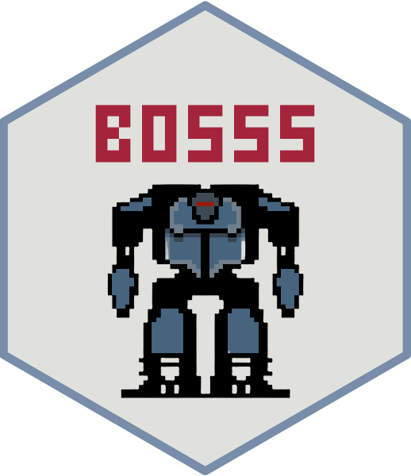
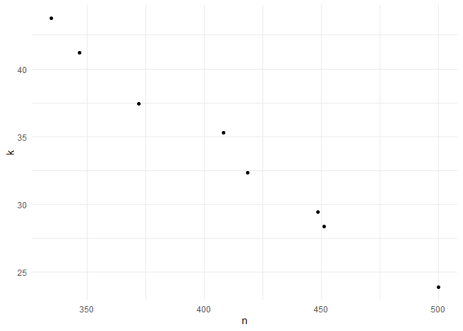

# BOSSS 

<!-- badges: start -->

[](https://github.com/DTWilson/BOSSS/actions/workflows/R-CMD-check.yaml)
[](https://app.codecov.io/gh/DTWilson/BOSSS)
<!-- badges: end -->

The goal of BOSSS is to help people use Bayesian optimisation to solve
sample size determination problems when simulation is required to
calculate operating characteristics.

## Installation

Install the released version of tout from CRAN:

``` r
install.packages("BOSSS")
```

Or you can install the development version of BOSSS from
[GitHub](https://github.com/) with:

``` r
# install.packages("devtools")
devtools::install_github("DTWilson/BOSSS")
```

## Example

Suppose we want to design a cluster-randomised controlled trial (cRCT)
which will compare the mean outcomes of two groups. We need to choose
per-arm number of clusters, $m$, and the number of participants in each
cluster, $n$. We would like to choose a design that jointly minimises
the total numbers of both clusters and participants whilst ensuring the
trial has 80% power to detect the target difference.

Suppose that there is no analytic power function for this problem, and
that we need to use simulation to estimate power instead. This can make
the search process very slow and unwieldy. BOSSS helps by using Bayesian
optimisation to carefully choose a design to evaluate at each iteration,
aiming for those that will give the most improvement over the best
designs found so far.

Key features:

- Trial design spaces can have several dimensions.
- Multiple objectives are handled in a non-scalarising way.
- Design optimisation problems can be constrained by deterministic or
  stochastic funstion.

The output of applying BOSSS to this problem is a set solutions which
satisfy the power constraint and offer a range of trade-offs between the
different objectives we are minimising (here, $n$ and $k$). For example,
consider the following `BOSSS_solution` object which resulted from
applying the BOSSS algorithm:

``` r
print(solution)
#> Design variables for the Pareto set: 
#> 
#>           m         n
#> 3  16.25000 31.250000
#> 23 26.68234 11.356760
#> 24 25.46286 12.628175
#> 27 32.23553  8.693621
#> 28 21.24456 17.364544
#> 30 44.50620  5.006974
#> 31 15.90497 33.592655
#> 32 15.97660 33.300705
#> 33 35.16044  7.472662
#> 34 18.11221 23.659648
#> 35 22.77665 14.799673
#> 36 19.53286 19.976495
#> 37 16.96081 26.999060
#> 39 39.15899  6.128533
#> 40 29.51204  9.758863
#> 
#> Corresponding objective function values...
#> 
#>    N, alt (mean) m, alt (mean)
#> 3       507.8125      16.25000
#> 23      303.0250      26.68234
#> 24      321.5494      25.46286
#> 27      280.2435      32.23553
#> 28      368.9021      21.24456
#> 30      222.8414      44.50620
#> 31      534.2902      15.90497
#> 32      532.0320      15.97660
#> 33      262.7420      35.16044
#> 34      428.5285      18.11221
#> 35      337.0870      22.77665
#> 36      390.1981      19.53286
#> 37      457.9258      16.96081
#> 39      239.9872      39.15899
#> 40      288.0040      29.51204
#> 
#> ...and constraint function values:
#> 
#>    s, alt (mean) s, alt (var)
#> 3      -1.635087  0.007324837
#> 23     -1.385545  0.006247190
#> 24     -1.515481  0.006771312
#> 27     -1.508727  0.006742163
#> 28     -1.556633  0.006953669
#> 30     -1.488637  0.006656733
#> 31     -1.410713  0.006342848
#> 32     -1.404385  0.006318540
#> 33     -1.522264  0.006800807
#> 34     -1.508727  0.006742163
#> 35     -1.488637  0.006656733
#> 36     -1.522264  0.006800807
#> 37     -1.348489  0.006111233
#> 39     -1.591789  0.007116091
#> 40     -1.442726  0.006468500
```

We have sixteen designs to choose from. For example, the final design in
the set involves 288 patients and 28 clusters in each arm. The estimated
power for that design is $1 - 1/(1 + \exp(1.535920)) = 0.82$.

We can visualise the trade-offs between the two objectives by plotting
the solution:

``` r
plot(solution)
```



For a detailed walkthrough of how to specify and solve a problems with
BOSSS, see the “Getting started” tab. Other applications are collected
in the “Examples” article.
