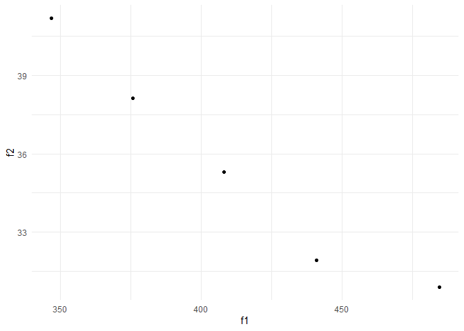

<!-- README.md is generated from README.Rmd. Please edit that file -->

# BOSSS

<!-- badges: start -->

[](https://github.com/DTWilson/BOSSS/actions/workflows/R-CMD-check.yaml)
<!-- badges: end -->

The goal of BOSSS is to …

## Installation

You can install the development version of BOSSS from
[GitHub](https://github.com/) with:

``` r
# install.packages("devtools")
devtools::install_github("DTWilson/BOSSS")
```

## Example

Suppose we want to design a cluster randomised RCT which will compare
the means of our two groups via a t test. To solve this problem using
BOSSS we start by writing two functions:

``` r
library(BOSSS)

sim_trial <- function(n=200, k=10, mu=0.3, var_u=0.05, var_e=0.95){

  # Number of patients in each cluster
  m <- n/k
  
  # SD of cluster means
  s_c <- sqrt(var_u + var_e/m)
  
  # Simulate cluster means
  x0 <- stats::rnorm(k, 0, s_c); x1 <- stats::rnorm(k, mu, s_c)
  
  return(c(s = stats::t.test(x0, x1)$p.value >= 0.05))
}

det_func <- function(n=200, k=10, mu=0.3, var_u=0.05, var_e=0.95){
  return(c(n=n, k=k))
}
```

The first function is a simulation, returning a binary output indicating
if the t test failed to return a significant result. The second function
is deterministic, returning the per-arm sample size and per-arm number
of clusters.

The first two arguments of our functions are the variables we can
control when designing the trial. We put ranges on these to define our
**design space**:

``` r
design_space <- design_space(lower = c(10, 3),
                             upper = c(500, 50),
                             sim = sim_trial)
```

The remaining three arguments are the parameters of the statistical
model. We choose which sets of values we will be simulating under and
call these sets **hypotheses**:

``` r
hypotheses <- hypotheses(values = matrix(c(0.3, 0.05, 0.95), ncol = 1),
                         hyp_names = c("alt"),
                         sim = sim_trial)
```

In our example we want to find the smallest trial which will keep the
type II error rate below 0.1. We specify this as a **constraint**:

``` r
constraints <- constraints(name = c("tII"),
                   out = c("s"),
                   hyp = c("alt"),
                   nom = c(0.1),
                   delta =c(0.95),
                   stoch = c(TRUE))
```

Finally, we formalise the **objectives** we want to minimise:

``` r
objectives <- objectives(name = c("f1", "f2"),
                 out = c("n", "k"),
                 hyp = c("alt", "alt"),
                 weight = c(10, 1),
                 stoch = c(FALSE, FALSE),
                 binary = c(FALSE, FALSE))
```

Together, these are the ingredients of a **problem** object:

``` r
problem <- BOSSS_problem(sim_trial, design_space, hypotheses, constraints, objectives, det_func = det_func)
```

With our problem specified, we generate a **solution** by evaluating a
first set of possible designs, evenly spread over our design space,
using `N` simulations each time:

``` r
size <- 40
N <- 500

solution <- BOSSS_solution(size, N, problem)
#> Checking simulation speed...
#> Initialisation will take approximately 0.2420796 secs 
#> Models fitted
#> Initial solution found
print(solution)
#>           n        k       f1       f2
#> 9  346.8750 41.18750 346.8750 41.18750
#> 13 408.1250 35.31250 408.1250 35.31250
#> 17 300.9375 48.53125 300.9375 48.53125
#> 21 484.6875 30.90625 484.6875 30.90625
#> 29 392.8125 39.71875 392.8125 39.71875
#> 37 461.7188 33.10938 461.7188 33.10938
```

Note that a BOSSS solution will be an estimated Pareto set whenever
there are more than one objectives.

To improve the solution we can **iterate** as many times as we like,
where each iteration will try to select the design which will give us
the biggest improvement:

``` r
for(i in 1:5){
  solution <- iterate(solution, problem, N)
}

print(solution)
#>           n        k       f1       f2
#> 9  346.8750 41.18750 346.8750 41.18750
#> 13 408.1250 35.31250 408.1250 35.31250
#> 21 484.6875 30.90625 484.6875 30.90625
#> 43 441.1153 31.93494 441.1153 31.93494
#> 44 375.8672 38.12792 375.8672 38.12792
```

We can also visualise our solution by plotting the Pareto front:

``` r
plot(solution)
```


