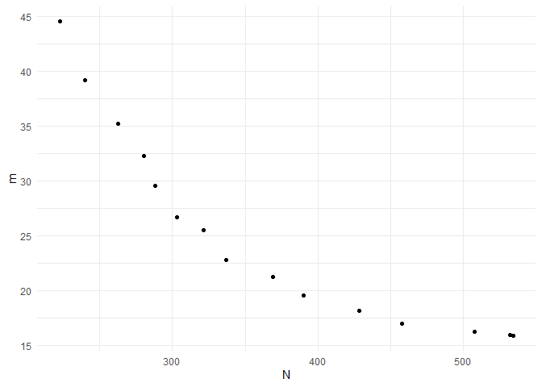

<!-- README.md is generated from README.Rmd. Please edit that file -->

# BOSSS 

<!-- badges: start -->

[](https://github.com/DTWilson/BOSSS/actions/workflows/R-CMD-check.yaml)
<!-- badges: end -->

The goal of BOSSS is to help people use Bayesain optimisation to solve
sample size determination problems when simulation is required to
calculate operating characteristics.

## Installation

You can install the development version of BOSSS from
[GitHub](https://github.com/) with:

``` r
# install.packages("devtools")
devtools::install_github("DTWilson/BOSSS")
```

## Example

Suppose we want to design a cluster randomised RCT which will compare
the mean outcomes of two groups. We need to choose the per-arm sample
size $n$ and the per-arm number of clusters $k$, aiming to minimise both
of these quantities whilst ensuring the trial has 90% power to detect
the target difference.

Suppose that there is no analytic power function for this problem, and
that we need to use simulation to estimate power instead. This can make
the search process very slow and unwieldy. BOSSS helps by using Bayesian
optimisation to carefully choose a design to evaluate at each iteration,
aiming for those that will give the most improvement over the best
designs found so far.

Key features:

- Trial design spaces can have several dimensions.
- Multiple objectives are handled in a non-scalarising way.
- Design optimisation problems can be constrained by deterministic or
  stochastic funstion.

The output of applying BOSSS to this problem is a set solutions which
satisfy the power constraint and offer a range of trade-offs between the
different objectives we are minimising (here, $n$ and $k$). For example,
consider the following `BOSSS_solution` object which resulted from
applying the BOSSS algorithm:

``` r
print(solution)
#> Design variables for the Pareto set: 
#> 
#>           n        k
#> 9  346.8750 41.18750
#> 13 408.1250 35.31250
#> 27 451.1951 28.36097
#> 28 334.7609 43.72750
#> 33 372.0348 37.45546
#> 36 499.9937 23.92778
#> 37 448.5287 29.46920
#> 38 418.5645 32.35209
#> 
#> Corresponding objective function values... 
#> 
#>    n, alt (mean) k, alt (mean)
#> 9       346.8750      41.18750
#> 13      408.1250      35.31250
#> 27      451.1951      28.36097
#> 28      334.7609      43.72750
#> 33      372.0348      37.45546
#> 36      499.9937      23.92778
#> 37      448.5287      29.46920
#> 38      418.5645      32.35209
#> 
#> ...and constraint function values:
#> 
#>    s, alt (mean) s, alt (var)
#> 9      -2.521850   0.02904061
#> 13     -2.359280   0.02533537
#> 27     -2.261940   0.02339297
#> 28     -2.087561   0.02036212
#> 33     -2.334207   0.02481645
#> 36     -2.193677   0.02214155
#> 37     -2.261940   0.02339297
#> 38     -2.384886   0.02587913
```

We have eight designs to choose from. For example, the final design in
the set involves 419 patients and 32 clusters in each arm. The estimated
power for that design is $1 - 1/(1 + \exp(2.38)) = 0.92$.

We can visualise the trade-offs between the two objectives by plotting
the solution:

``` r
plot(solution)
```



For a detailed walkthrough of how to specify and solve a problems with
`BOSSS`, see the “Getting started” tab. Other applications are collected
in the “Examples” article.
