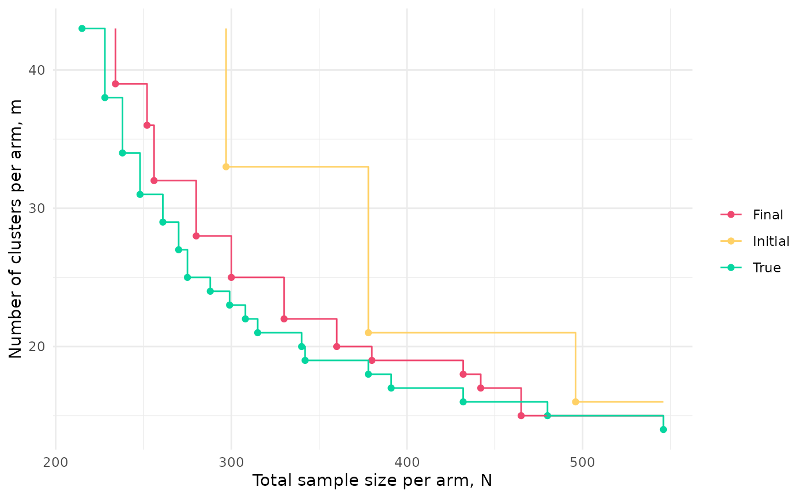
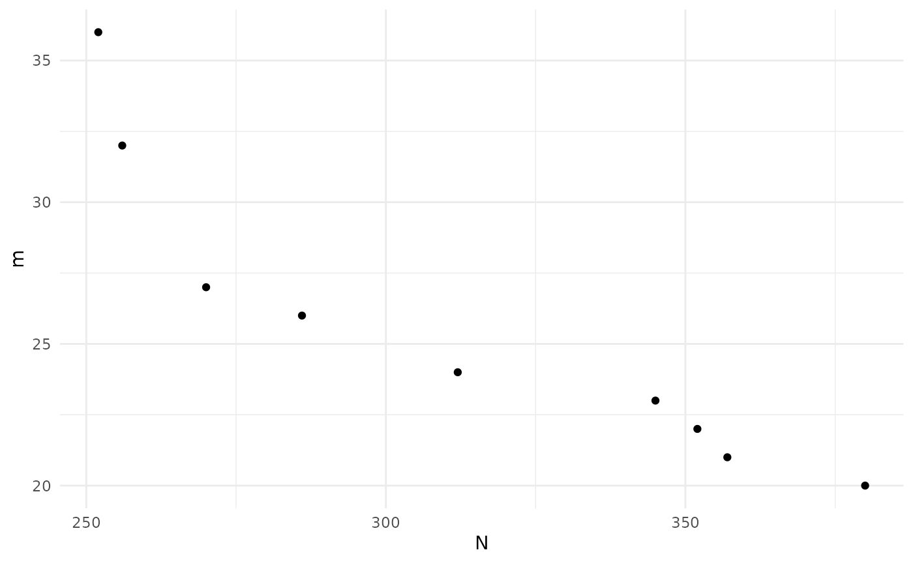
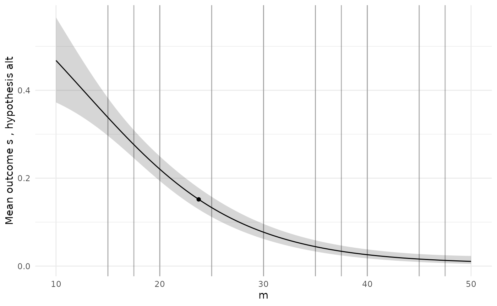
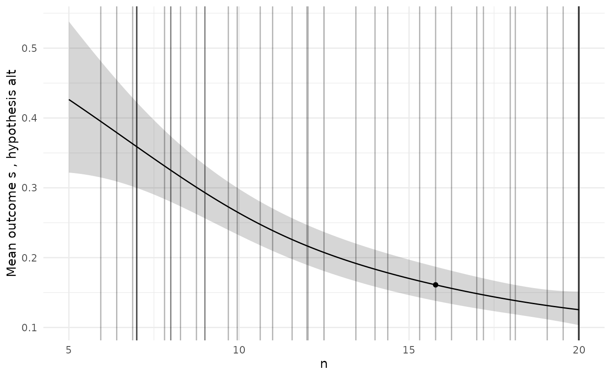
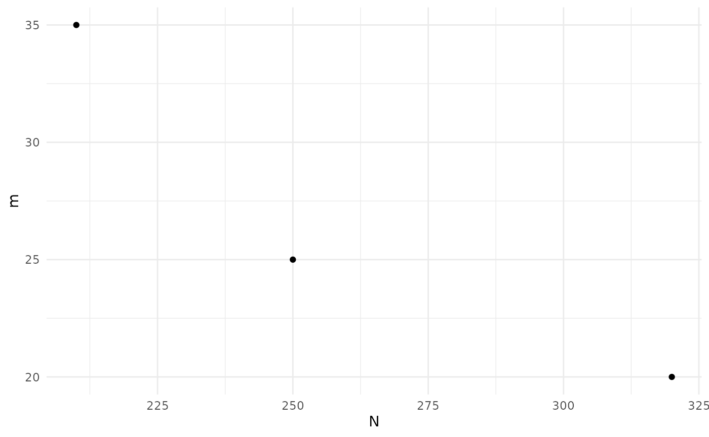
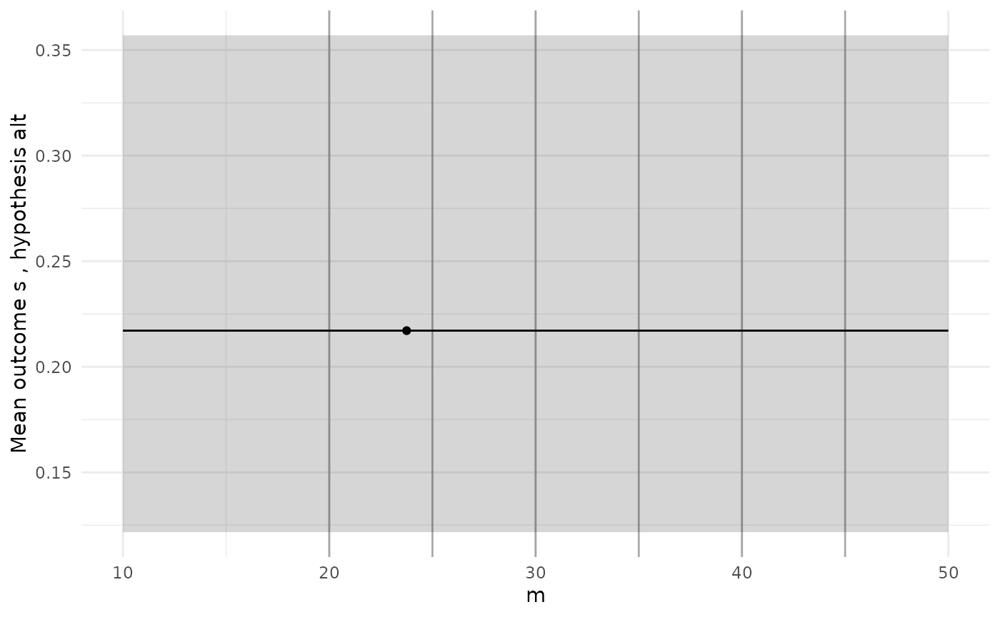
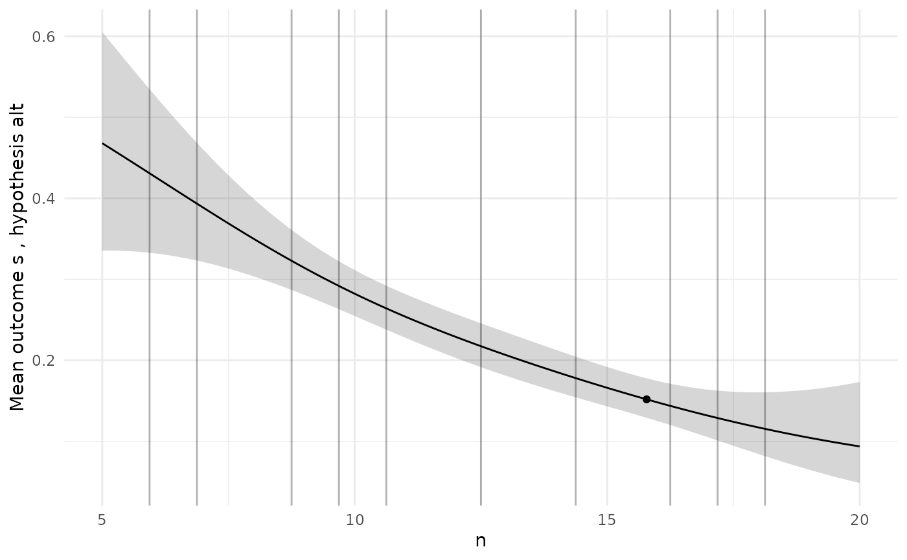

# BOSSS

``` r
library(BOSSS)
library(ggplot2)
library(mco)
library(here)
#> here() starts at /home/runner/work/BOSSS/BOSSS
```

Every application of BOSSS follows the same set of steps:

1.  Formally specify the problem and create a corresponding
    `BOSSS_problem` object;
2.  Create a `BOSSS_solution` object and initialise it;
3.  Perform a number of iterations, each one updating and (hopefully)
    improving the `BOSSS_solution` object;
4.  Select a final design and run some diagnostics to check it is valid.

We will work through these steps here for an example problem: designing
a cluster randomised trial, as discussed in Section 2 of the manuscript
associated with the package. For more illustrations, see the article.

### Problem

The first ingredient of a BOSSS problem is the simulation function. The
arguments of this function must first specify the *design variables*
which we want to vary in our problem, followed by the *model
parameters*. In this example we have two design variables representing
the number of clusters in each arm, and the number of participants in
each arm. The model parameters are the mean difference in outcome
between the control and experimental arms (`beta_1`), the within-cluster
variance (`var_e`), and the between-cluster variance (`var_u`). Note
that all of these inputs require some defaults to be provided.

The other element of interface the simulation function must conform to
is in its return value, which should be a named vector of the quantities
who’s mean values we want to estimate using the Monte Carlo method.
Here, we have one such quantity: a boolean indicator of a negative
decision, `s`.

``` r
sim_cRCT <- function(design = list(m = 10, n = 20), 
                     hypothesis = list(beta_1 = 0.3, var_e = 0.95, var_u = 0.05)){
  
  m <- design[[1]]; n <- design[[2]]
  beta_1 <- hypothesis[[1]]; var_e <- hypothesis[[2]]; var_u <- hypothesis[[3]]
  
  m <- floor(m); n <- floor(n)
  
  x <- rep(c(0,1), each = m) 
  y <- rnorm(2*m, 0, sqrt(var_u + var_e/n))
  y <- y + x*beta_1

  s <- stats::t.test(y[x==1], y[x==0], alternative = "greater")$p.value > 0.025

  return(c(s = s))
}

# For example,
sim_cRCT()
```

In our problem we are not just interested in the expected value of `s`;
we also want to minimise the number of clusters and the number of
participants. Since these are fixed quantities given any design, we
evaluate them in a separate deterministic function. This should conform
to the same principles as the simulation function, with the same inputs,
but allowing for different named outputs. Here, the outputs are just
`m`, and `N = n*m`:

``` r
det_cRCT <- function(design = list(m = 10, n = 20), 
                     hypothesis = list(beta_1 = 0.3, var_e = 0.95, var_u = 0.05))
{
  m <- design[[1]]; n <- design[[2]]
  beta_1 <- hypothesis[[1]]; var_e <- hypothesis[[2]]; var_u <- hypothesis[[3]]
  
  return(c(m = floor(m), N = floor(n)*floor(m)))
}  
```

Next, we need to note the ranges of the design variables which we plan
to search over. We use the
[`design_space()`](https://dtwilson.github.io/BOSSS/reference/design_space.md)
function for this, specifying the lower and upper limits of the design
variables in the order they appear as simulation function arguments:

``` r
design_space <- design_space(lower = c(10, 5), 
                             upper = c(50, 20),
                             sim = sim_cRCT)

design_space
```

Note that the function automatically retrieves the names of the design
variables based on the order they take in the simulation function.

We also need to specify the hypotheses which we’re planning to simulate
under, using the
[`hypotheses()`](https://dtwilson.github.io/BOSSS/reference/hypotheses.md)
function, again specifying in the order that parameters appear as
simulation function argument. We only need one hypothesis here, the
alternative, since we will be estimating the type II error rate.

``` r
hypotheses <- hypotheses(values = matrix(c(0.3, 0.95, 0.05), ncol = 1),
                         hyp_names = c("alt"),
                         sim = sim_cRCT)

hypotheses
```

Constraints should be specified using the `constraints` function. Each
constraint should be named, and should be defined with respect to a
specific output and a specific hypothesis. It should have a nominal
maximum value, and a probability `delta` used to judge if it is
satisfied. Here, our constraint is that the mean of the simulation
output (i.e. the probability of a negative result) under the `alt`
hypothesis should be less than or equal to 0.2 with a probability of at
least 0.95. Finally, we note whether the constraint output is binary or
otherwise.

``` r
constraints <- constraints(name = c("con_tII"),
                   out = c("s"),
                   hyp = c("alt"),
                   nom = c(0.2),
                   delta = c(0.95),
                   binary = c(TRUE))

constraints
```

The final ingredient of the problem is the set of objectives we want to
minimise. Similar to constraints, objectives are tied to a specific
output and hypothesis. We also specify weights for each objective which
help guide the internal optimisation process, and note whether or not
the output for each objective is binary or continuous. For example, here
we want to minimise both the number of patients `N` and the number of
clusters `m`, with the latter carrying a weight of 100 times that of the
former.

``` r
objectives <- objectives(name = c("N", "m"),
                 out = c("N", "m"),
                 hyp = c("alt", "alt"),
                 weight = c(1, 10),
                 binary = c(FALSE, FALSE))

objectives
```

We now put this simulation function and set of data frames together to
create an object of class `BOSSS_problem`.

``` r
prob <- BOSSS_problem(sim_cRCT, design_space, objectives, hypotheses, constraints, det_func = det_cRCT)
```

### Initialisation

Having set up the problem, we now need to create an initial solution to
it. This involves setting up a space-filling set of designs spanning the
design space (where `size` is the number of designs), computing the
Monte Carlo estimates of all the expectations we are interested in at
each of these designs (using `N` samples for each evaluation), fitting
Gaussian Process models to these estimates, and then using those models
to estimate the Pareto set and front:

``` r
set.seed(9823579)

size <- 20
N <- 100

sol <- BOSSS_solution(size, N, prob)
```

``` r
print(sol) 
#> Design variables for the Pareto set: 
#> 
#>        m        n
#> 2  40.00  8.75000
#> 19 23.75 15.78125
#> 
#> Corresponding objective function values...
#> 
#>    N, alt (mean) m, alt (mean)
#> 2            320            40
#> 19           345            23
#> 
#> ...and constraint function values:
#> 
#>    s, alt (mean) s, alt (var)
#> 2      -2.419826    0.1333284
#> 19     -1.442005    0.0646562
plot(sol)
```



``` r
sol_init <- sol
```

The [`print()`](https://rdrr.io/r/base/print.html) function will give a
table of the Pareto set with associated objective function values. The
[`plot()`](https://rdrr.io/r/graphics/plot.default.html) function will
plot the Pareto front.

### Iteration

We can now start improving this solution by calling the
[`iterate()`](https://dtwilson.github.io/BOSSS/reference/iterate.md)
function. Each call uses the fitted Gaussian Process models to decide on
the next design to be evaluated, computes the Monte Carlo estimates at
that point, and then updates the estimated Pareto set and front.

``` r
N <- 100
for(i in 1:20) {
  sol <- iterate(sol, prob, N) 
}
```

``` r
print(sol)
#> Design variables for the Pareto set: 
#> 
#>           m         n
#> 19 23.75000 15.781250
#> 23 26.99935 11.997542
#> 26 20.99972 19.999855
#> 29 24.97515 13.999811
#> 31 32.99968  8.999911
#> 33 27.95746 10.990021
#> 34 36.93869  7.994242
#> 36 22.97379 16.990697
#> 40 21.99923 17.975259
#> 
#> Corresponding objective function values...
#> 
#>    N, alt (mean) m, alt (mean)
#> 19           345            23
#> 23           286            26
#> 26           380            20
#> 29           312            24
#> 31           256            32
#> 33           270            27
#> 34           252            36
#> 36           352            22
#> 40           357            21
#> 
#> ...and constraint function values:
#> 
#>    s, alt (mean) s, alt (var)
#> 19     -1.442005   0.06465620
#> 23     -1.507734   0.06737895
#> 26     -1.259177   0.05806410
#> 29     -1.648184   0.07389930
#> 31     -1.507734   0.06737895
#> 33     -1.317975   0.06003526
#> 34     -1.202247   0.05628104
#> 36     -1.576338   0.07043940
#> 40     -1.978171   0.09367830
plot(sol)
```



``` r
sol_final <- sol
```

We can compare the initial and final approximations to the Pareto front
to the actual front since, for this simple example, we can calculate
power analytically:

### Diagnostics

To check the GP models are giving sensible predictions, we can choose a
specific design and then plot the predictions for each model along the
range of each design variable.

``` r
# Pick a specific design from the Pareto set
design <- sol$p_set[1,]

ps <- diag_plots(design, prob, sol)

ps[[1]]
```



``` r
#ggsave(here("man", "figures", "cRCT_diag_m.pdf"), height=8, width=8, units="cm")

ps[[2]]
```



``` r
#ggsave(here("man", "figures", "cRCT_diag_n.pdf"), height=8, width=8, units="cm")
```

We can also get the predicted values and 95% credible intervals for each
point we have evaluated, contrasting these with the empirical MC
estimate and interval. This will return a data frame for each of the
models, named according to the output-hypothesis combination which
defines it. We highlight with a `*` any points where the two intervals
do not overlap.

``` r
diag_predictions(prob, sol)
#> $`Output: s, hypothesis: alt`
#>           m         n    MC_mean      MC_l95     MC_u95     p_mean      p_l95
#> 1  30.00000 12.500000 0.11155378 0.063118649 0.18963338 0.12762251 0.10772147
#> 2  40.00000  8.750000 0.08167331 0.041666820 0.15392252 0.13890888 0.11684352
#> 3  20.00000 16.250000 0.21115538 0.142069426 0.30201037 0.22166509 0.19147619
#> 4  25.00000 10.625000 0.18127490 0.117482371 0.26914262 0.22750507 0.19918432
#> 5  45.00000 18.125000 0.01195219 0.001988476 0.06841874 0.02556474 0.01226616
#> 6  35.00000  6.875000 0.23107570 0.158794949 0.32360083 0.23138686 0.20070363
#> 7  15.00000 14.375000 0.44023904 0.346374267 0.53858093 0.35342547 0.30492322
#> 8  17.50000  9.687500 0.40039841 0.309210032 0.49905109 0.38829725 0.33317646
#> 9  37.50000 17.187500 0.06175299 0.028329144 0.12936153 0.04308112 0.02818094
#> 10 47.50000  5.937500 0.20119522 0.133803478 0.29112177 0.19624201 0.14331310
#> 11 27.50000 13.437500 0.11155378 0.063118649 0.18963338 0.13983730 0.11872020
#> 12 22.50000  7.812500 0.37051793 0.281742889 0.46900021 0.35198590 0.29843680
#> 13 42.50000 15.312500 0.03187251 0.010672159 0.09130098 0.03995067 0.02444646
#> 14 32.50000 11.562500 0.10159363 0.055809001 0.17786349 0.12213350 0.10254115
#> 15 12.50000 19.062500 0.35059761 0.263632739 0.44876675 0.35459382 0.28675581
#> 16 13.75000 12.031250 0.35059761 0.263632739 0.44876675 0.41355431 0.35217076
#> 17 33.75000 19.531250 0.02191235 0.005838964 0.07872833 0.04749012 0.03065901
#> 18 43.75000  8.281250 0.12151394 0.070564158 0.20128432 0.13509492 0.10727229
#> 19 23.75000 15.781250 0.19123506 0.125606506 0.28016698 0.16106173 0.13743118
#> 20 28.75000  6.406250 0.28087649 0.201616667 0.37659748 0.30993552 0.25660633
#> 21 31.98561  8.998203 0.18127490 0.117482371 0.26914262 0.18663142 0.16437288
#> 22 21.99748 19.995216 0.17131474 0.109435453 0.25804488 0.15091308 0.12657099
#> 23 26.99935 11.997542 0.18127490 0.117482371 0.26914262 0.16935818 0.14637433
#> 24 21.99730 19.976786 0.12151394 0.070564158 0.20128432 0.15103828 0.12678562
#> 25 39.97274  6.988479 0.14143426 0.085811927 0.22426578 0.19393465 0.16840712
#> 26 20.99972 19.999855 0.22111554 0.150400931 0.31283581 0.16720993 0.14127366
#> 27 37.99189  6.993664 0.23107570 0.158794949 0.32360083 0.20584294 0.18005862
#> 28 39.99514  6.998776 0.18127490 0.117482371 0.26914262 0.19344642 0.16798199
#> 29 24.97515 13.999811 0.16135458 0.101470755 0.24686949 0.16480626 0.14107123
#> 30 39.99366  6.999902 0.26095618 0.184326258 0.35555664 0.19341562 0.16795954
#> 31 32.99968  8.999911 0.18127490 0.117482371 0.26914262 0.17763129 0.15617459
#> 32 35.95488  7.996821 0.19123506 0.125606506 0.28016698 0.18555315 0.16397734
#> 33 27.95746 10.990021 0.21115538 0.142069426 0.30201037 0.17805154 0.15493518
#> 34 36.93869  7.994242 0.23107570 0.158794949 0.32360083 0.17893502 0.15774364
#> 35 20.99066 19.995778 0.19123506 0.125606506 0.28016698 0.16739322 0.14146170
#> 36 22.97379 16.990697 0.17131474 0.109435453 0.25804488 0.16039072 0.13758832
#> 37 30.91326  9.949006 0.15139442 0.093594026 0.23561162 0.17071928 0.14900537
#> 38 20.99732 19.985637 0.12151394 0.070564158 0.20128432 0.16735196 0.14148721
#> 39 20.99805 19.995083 0.14143426 0.085811927 0.22426578 0.16727238 0.14135857
#> 40 21.99923 17.975259 0.12151394 0.070564158 0.20128432 0.16681275 0.14450253
#>         p_u95 no_overlap
#> 1  0.15057972           
#> 2  0.16436568           
#> 3  0.25511186           
#> 4  0.25855250           
#> 5  0.05251463           
#> 6  0.26520450           
#> 7  0.40514579           
#> 8  0.44643203           
#> 9  0.06532988           
#> 10 0.26272398           
#> 11 0.16401151           
#> 12 0.40953454           
#> 13 0.06463631           
#> 14 0.14486506           
#> 15 0.42883130           
#> 16 0.47774684           
#> 17 0.07286656           
#> 18 0.16876955           
#> 19 0.18787045           
#> 20 0.36884873           
#> 21 0.21114250           
#> 22 0.17897734           
#> 23 0.19512602           
#> 24 0.17897931           
#> 25 0.22229731           
#> 26 0.19681647           
#> 27 0.23426463           
#> 28 0.22174224           
#> 29 0.19164367           
#> 30 0.22170181           
#> 31 0.20133254           
#> 32 0.20925728           
#> 33 0.20378516           
#> 34 0.20228952           
#> 35 0.19698761           
#> 36 0.18615643           
#> 37 0.19487286           
#> 38 0.19686073           
#> 39 0.19684762           
#> 40 0.19179528
```

In this example we see that the empirical estimates agree with the
predictions for all of the designs which have been evaluated. Once we
are happy with our solution and have chosen a specific design from the
Pareto set, we might want to double check that point by running a large
number of simulations at it:

``` r
design <- sol$p_set[1,]
r <- diag_check_point(design, prob, sol, N=10^4) 
#> Model 1 prediction interval: [0.137, 0.188]
#> Model 1 empirical interval: [0.151, 0.165]
```

At any point, but especially after initialisation, we may decide that we
need more points in our initial evaluations, or more simulations at each
of the points evaluated so far. For example, suppose we started off with
only 10 evaluations at each of 6 initial designs:

``` r
set.seed(98579)

size <- 6
N <- 10

sol <- BOSSS_solution(size, N, prob)
#> 
#> Checking simulation speed...
#> Initialisation will take approximately 0.01583219 secs 
#> Solution found

print(sol) 
#> Design variables for the Pareto set: 
#> 
#>    m      n
#> 3 20 16.250
#> 4 25 10.625
#> 6 35  6.875
#> 
#> Corresponding objective function values...
#> 
#>   N, alt (mean) m, alt (mean)
#> 3           320            20
#> 4           250            25
#> 6           210            35
#> 
#> ...and constraint function values:
#> 
#>   s, alt (mean) s, alt (var)
#> 3    -1.3156768    0.5995565
#> 4    -1.3156768    0.5995565
#> 6    -0.3894648    0.4153610
plot(sol)
```



``` r
sol_init <- sol

# Take the first solution in the Pareto set and plot diagnostics:
sol$p_set[1,]
#>    m     n   N  m
#> 3 20 16.25 320 20
diag_plots(design, prob, sol)
#> [[1]]
```



    #> 
    #> [[2]]


The diagnostic plots here show a GP model of the true power function
which is just a constant, which we know is not true. When we see a poor
initial fit like this we might want to add more simulations to designs
already evaluated, or add more designs, or both. We can use the
[`extend_initial()`](https://dtwilson.github.io/BOSSS/reference/extend_initial.md)
function for this. For example, suppose we want an extra 4 designs and
for every design to have 500 simulations:

``` r
sol <- extend_initial(prob, sol, extra_points = 4, extra_N = 490)

sol$p_set[1,]
#>       m      n   N  m
#> 10 47.5 5.9375 235 47
diag_plots(design, prob, sol)
#> [[1]]
```


    #> 
    #> [[2]]



Our plots now suggest a more plausible model.
